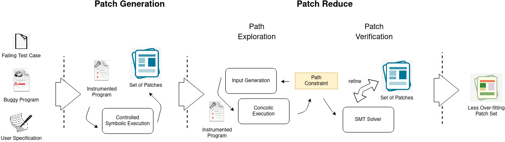

# CPR - CardioPulmonary Resuscitation
CPR: A new automated program repair technique based on concolic execution
which works on patch abstraction with the sub-optimal goal of refining the patch to less over-fit 
the initial test cases. 

Automated program repair reduces the manual effort in fixing program errors. 
However, existing repair techniques modify a buggy program such that it passes given tests.
Such repair techniques do not discriminate between correct patches and patches that overfit
the available tests and break untested but desired functionality. We attempt to solve this
problem with a novel solution that make use of the duality of space exploration in Input 
Space and Program Space. We implemented our technique in the form of a tool called CPR and
evaluated its efficacy in reducing the patch space by discarding overfitting patches from 
a pool of plausible patches. Similar to Cardio-Pulmonary Resuscitation (CPR) does to a
patient, our tool CPR resuscitate or recover programs via appropriate fixes. 

In this work, we therefore propose and implement an integrated approach for detecting and discarding 
overfitting patches by exploiting the relationship between the patch space and input space.
We leverage concolic path exploration to systematically traverse the input space 
(and generate inputs), while systematically ruling out significant parts of the patch space.
Given a long enough time budget, this approach allows a significant reduction in the 
pool of patch candidates, as shown by our experiments. 

## Workflow
Given the buggy program, a repair budget (time limit, iteration count), the fault location(s), 
a user specification, the language components for the synthesis, a failing test-case 
and optionally, a set of initial functional(passing) test cases, CPR generate a 
refined set of patches that are less over-fitting. The user specification defines 
the desired behavior of the repaired program (in addition to satisfying the given 
test cases). If initial tests are available, we assume that at least one failing 
test is available, which our method seeks to repair, apart from making sure that 
the user provided specification holds for all paths traversed via concolic exploration. 
Finally, CPR produces a ranked set of patches based on the explored input space. 

## Build and Dependencies
We provide a ready-made container which includes all necessary envrionment set-up
to deploy and run our tool. Dependencies include:

* LLVM 3.4
* KLEE 1.4
* Python 3.7
* Z3Solver
* MathSAT Solver

Build and run a container:

    docker build -t fitreduce .
    docker run --rm -ti fitreduce /bin/bash

# Example
We provide several examples you can run to test our tool, all test cases are included
in the 'tests' directory. 

Run examples:

    python3.7 CPR.py --conf=tests/bug-types/div-zero/div-zero-1/repair.conf
    python3.7 CPR.py --conf=tests/bug-types/div-zero/div-zero-2/repair.conf

## Documentation ##

* [Getting Started](doc/GetStart.md)
* [Example Usage](doc/Examples.md)
* [Manual](doc/Manual.md)
* [Troubleshooting](doc/Troubleshooting.md)
* [Experiment Replication](doc/Replication.md)